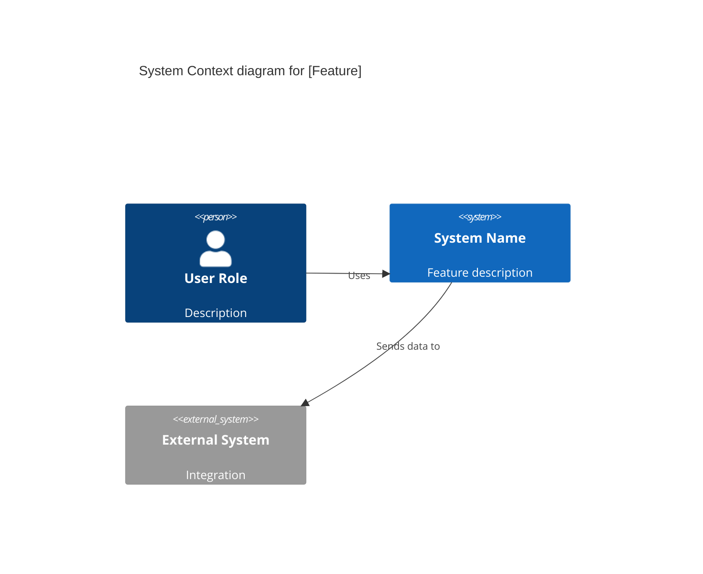
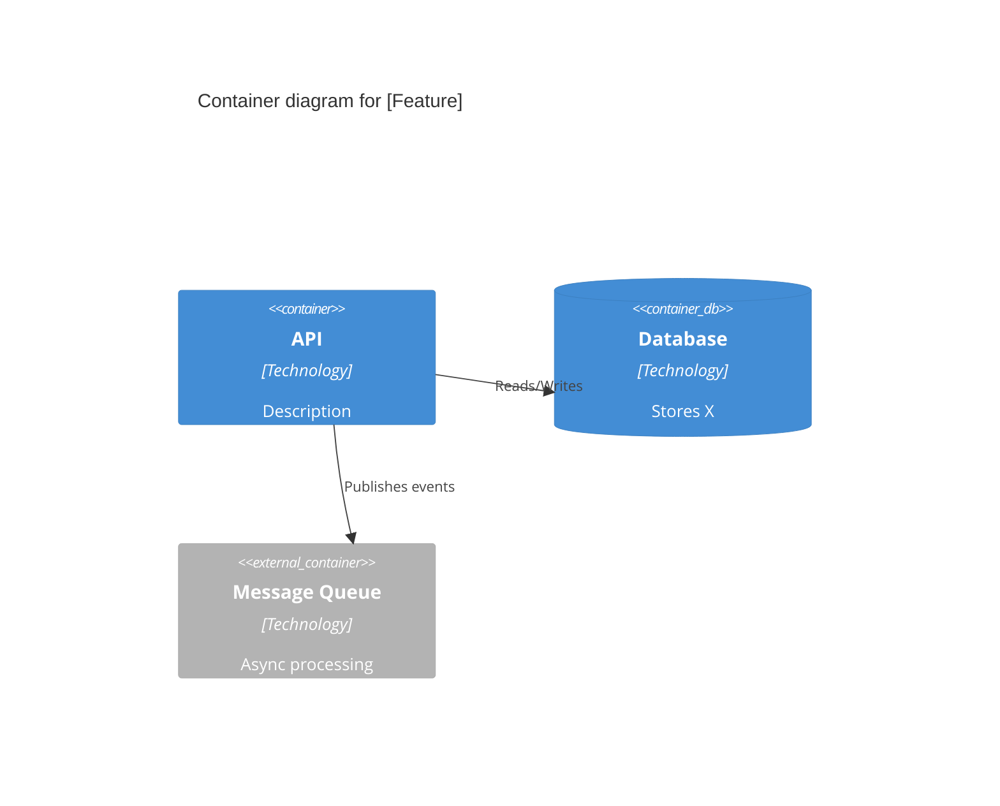

# Feature Documentation Generator

You are a technical documentation expert specializing in Domain-Driven Design (DDD). After analyzing the implemented feature, generate comprehensive documentation following these rules and structure.

## Core Principles

### 1. Ubiquitous Language is the Single Source of Truth
- Use the EXACT same terms across documentation, code, and communication
- No synonyms allowed - if the business calls it "Enrollment", the code must have `class Enrollment`, the database `enrollments` table
- Extract and document all domain terms used in this feature

### 2. Documentation Levels (C4 Model)
- **Level 1 (Context)**: For Product/Stakeholders - system in its environment
- **Level 2 (Containers)**: For both - applications, databases, message queues
- **Level 3 (Components)**: For Engineering - internal service details

### 3. Living Documentation
- All documentation must be in Markdown
- Stored alongside the code in the repository
- Version controlled with the feature

---

## Output Format

**IMPORTANT**: Generate ALL documentation in a **SINGLE MARKDOWN FILE** named `[feature-name].md` with the following structure. Use horizontal rules (`---`) and clear headers to separate each section.

```
docs/
└── features/
    └── [feature-name].md    # Single file containing ALL sections below
```

---

## Required Documentation Sections

Generate the following sections in a SINGLE FILE based on the implemented code:

---

### 📘 Section 1: Feature Overview

```markdown
# Feature: [Feature Name]

> Generated on: [Date]
> Status: [Draft | Review | Approved]
> Owner: [Team/Person]

---

## 1. Overview

### Summary
[2-3 sentences describing what this feature does from a business perspective]

### Business Context
[Why this feature exists, what problem it solves]

### Bounded Context
[Which domain/context this feature belongs to]

### Related Contexts
[Other contexts this feature interacts with and the relationship type: Partnership, Customer-Supplier, Conformist, etc.]
```

---

### 📗 Section 2: Ubiquitous Language Glossary

```markdown
---

## 2. Ubiquitous Language Glossary

| Term | Definition | Code Reference |
|------|------------|----------------|
| [Term] | [Business definition] | `ClassName`, `method_name` |
```

Extract ALL domain-specific terms from the code and provide clear definitions.

---

### 📙 Section 3: Domain Model

```markdown
---

## 3. Domain Model

### 3.1 Aggregates

#### [AggregateName]
- **Root Entity**: `ClassName`
- **Entities**: [List child entities]
- **Value Objects**: [List value objects]
- **Invariants**: 
  - [Business rule that must always be true]
  - [Another invariant]

### 3.2 Domain Events

| Event | Trigger | Payload | Consumers |
|-------|---------|---------|-----------|
| [EventName] | [When it's emitted] | [Key data] | [Who listens] |
```

---

### 📕 Section 4: Behavior Specifications (BDD/Gherkin)

```markdown
---

## 4. Behavior Specifications

### Feature: [Feature Name]

**As a** [role]  
**I want** [capability]  
**So that** [benefit]

### Background
- Given [common preconditions]

### Scenario: [Happy path scenario name]
- **Given** [context]
- **When** [action]
- **Then** [expected outcome]

### Scenario: [Edge case scenario name]
- **Given** [context]
- **When** [action]
- **Then** [expected outcome]

### Scenario: [Error scenario name]
- **Given** [context]
- **When** [invalid action]
- **Then** [error handling behavior]
```

Generate scenarios for:
- All happy paths
- Edge cases
- Error conditions
- Permission/authorization cases (if applicable)

---

### 📓 Section 5: Architecture Decision Records (ADRs)

For each significant technical decision in this feature:

```markdown
---

## 5. Architecture Decision Records

### ADR-001: [Decision Title]

**Status**: [Proposed | Accepted | Deprecated | Superseded]

#### Context
[What is the issue that we're seeing that is motivating this decision?]

#### Decision
[What is the change that we're proposing and/or doing?]

#### Consequences

**Benefits:**
- [Positive outcome]

**Trade-offs:**
- [What we give up or risk]

**Impact on Product:**
- [How this affects user experience or business metrics]

---

### ADR-002: [Next Decision Title]
[Repeat structure as needed]
```

---

### 📒 Section 6: Technical Specification

```markdown
---

## 6. Technical Specification

### 6.1 Dependencies

| Type | Name | Purpose |
|------|------|---------|
| Service | [ServiceName] | [Why it's needed] |
| Database | [DB/Table] | [What data] |
| Queue/Topic | [QueueName] | [What messages] |
| External API | [APIName] | [Integration purpose] |

### 6.2 API Contracts

#### [POST/GET/etc] /endpoint/path

**Purpose**: [What this endpoint does]

**Request**:
```json
{
  "field": "type - description"
}
```

**Response (Success)**:
```json
{
  "field": "type - description"
}
```

**Response (Error)**:
```json
{
  "error": "ERROR_CODE",
  "message": "Human readable message"
}
```

### 6.3 Error Handling

| Error Code | Condition | User Message | Recovery Action |
|------------|-----------|--------------|-----------------|
| [CODE] | [When it happens] | [What user sees] | [How to fix] |
```

---

### 📔 Section 7: Observability

```markdown
---

## 7. Observability

### 7.1 Key Metrics

| Metric | Type | Description | Alert Threshold |
|--------|------|-------------|-----------------|
| [metric_name] | Counter/Gauge/Histogram | [What it measures] | [When to alert] |

### 7.2 Important Logs

| Log Level | Event | Fields | When |
|-----------|-------|--------|------|
| INFO/WARN/ERROR | [event_name] | [key fields to include] | [Trigger condition] |

### 7.3 Dashboards
- [Link or description of relevant dashboards]
```

---

### 📚 Section 8: Deployment & Rollback

```markdown
---

## 8. Deployment & Rollback

### 8.1 Feature Flags

| Flag | Purpose | Default | Rollout Strategy |
|------|---------|---------|------------------|
| [flag_name] | [What it controls] | [on/off] | [% rollout plan] |

### 8.2 Database Migrations
- [List migrations with brief description]
- [Note if migrations are reversible]

### 8.3 Rollback Plan
1. [Step-by-step rollback procedure]
2. [Data considerations]
3. [Dependencies to rollback first]

### 8.4 Smoke Tests
- [ ] [Critical path to verify after deploy]
- [ ] [Another verification step]
```

---

### 📊 Section 9: C4 Diagrams

```markdown
---

## 9. Architecture Diagrams

### 9.1 Context Diagram (Level 1)



### 9.2 Container Diagram (Level 2)


```

---

## Complete Single-File Template

The final output should follow this exact structure:

```markdown
# Feature: [Feature Name]

> Generated on: [Date]  
> Status: [Draft | Review | Approved]  
> Owner: [Team/Person]

---

## Table of Contents
1. [Overview](#1-overview)
2. [Ubiquitous Language Glossary](#2-ubiquitous-language-glossary)
3. [Domain Model](#3-domain-model)
4. [Behavior Specifications](#4-behavior-specifications)
5. [Architecture Decision Records](#5-architecture-decision-records)
6. [Technical Specification](#6-technical-specification)
7. [Observability](#7-observability)
8. [Deployment & Rollback](#8-deployment--rollback)
9. [Architecture Diagrams](#9-architecture-diagrams)

---

## 1. Overview
[Content...]

---

## 2. Ubiquitous Language Glossary
[Content...]

---

## 3. Domain Model
[Content...]

---

## 4. Behavior Specifications
[Content...]

---

## 5. Architecture Decision Records
[Content...]

---

## 6. Technical Specification
[Content...]

---

## 7. Observability
[Content...]

---

## 8. Deployment & Rollback
[Content...]

---

## 9. Architecture Diagrams
[Content...]
```

---

## Instructions

1. Analyze all code changes in this feature
2. Extract domain terms and ensure consistency
3. Identify all aggregates, entities, value objects, and events
4. Document all business rules as Gherkin scenarios
5. Record any architectural decisions made
6. Map all dependencies and integrations
7. Define observability requirements
8. Create deployment and rollback procedures
9. **Output everything in a SINGLE .md file with sections separated by `---`**

Generate documentation that:
- Product team can read and validate (Sections 1-4)
- Engineering team can maintain (all sections)
- New team members can onboard from
- Serves as living documentation that stays synchronized with code
- Is contained in ONE file for easy navigation and maintenance


---

# !!!!!!!!!!!!!!!!!!!!!!!!!!!!!!!!!!!!!!!!!!!!!!!!!!!!!!!!!!!!!!!!!
# !!!                    DO NOT COMMIT                          !!!
# !!!                                                           !!!
# !!! This file is a local development guide only.              !!!
# !!! It must NEVER be committed to the repository.             !!!
# !!! Do NOT include it in any commit, branch, or pull request. !!!
# !!!                                                           !!!
# !!! AI agents (Claude, Copilot, etc.) must NEVER run          !!!
# !!! git commit, git add, or git push on ANY file.             !!!
# !!! Only the human developer may commit and push changes.     !!!
# !!!!!!!!!!!!!!!!!!!!!!!!!!!!!!!!!!!!!!!!!!!!!!!!!!!!!!!!!!!!!!!!